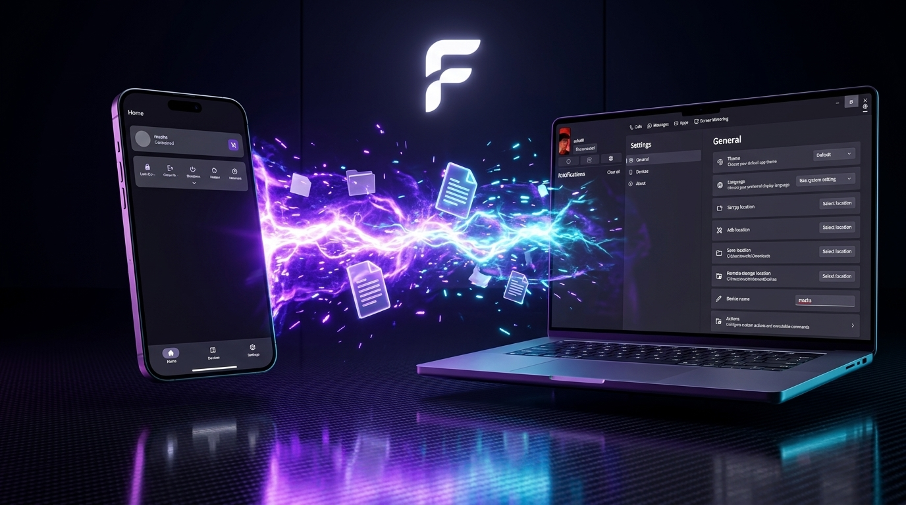
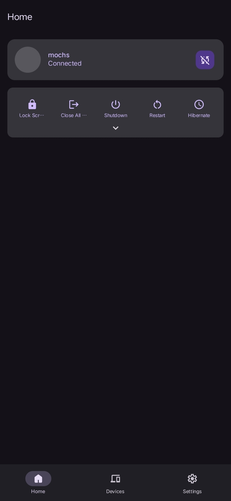
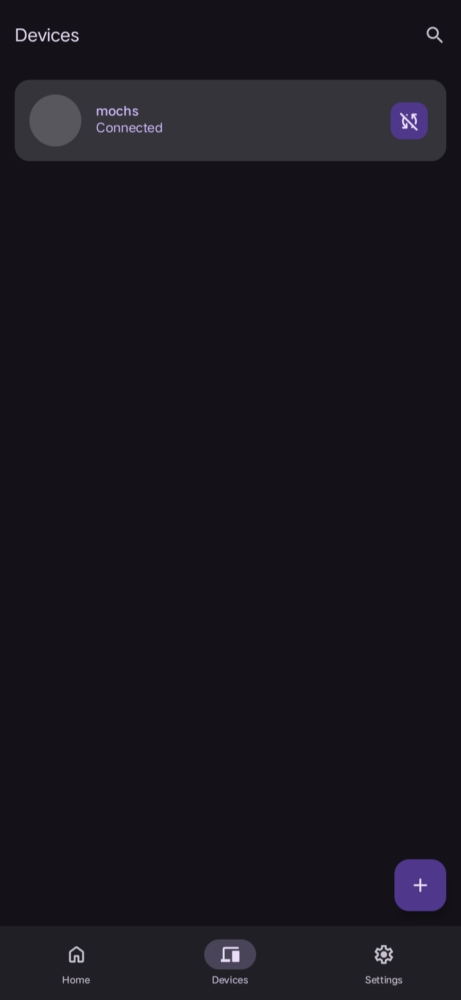
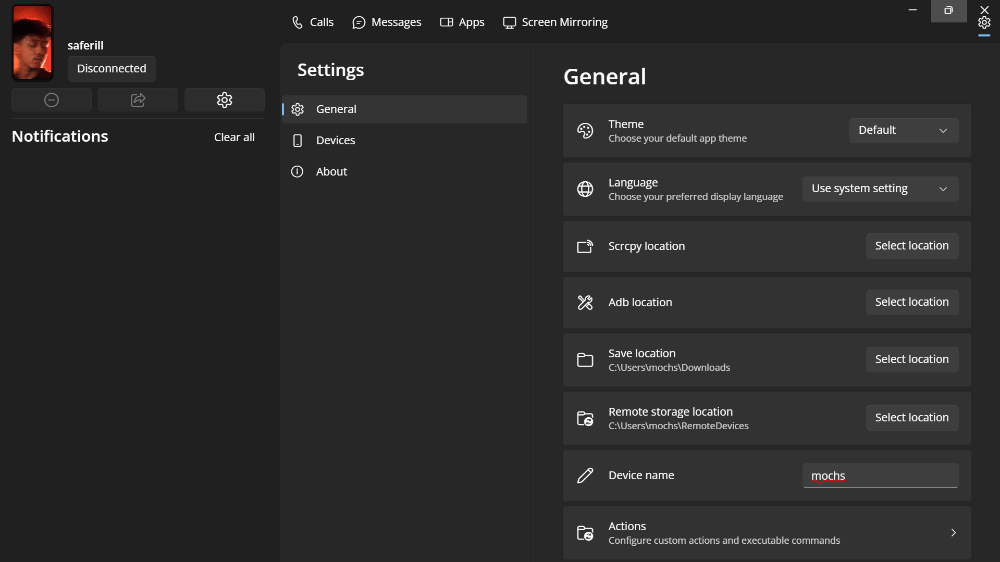
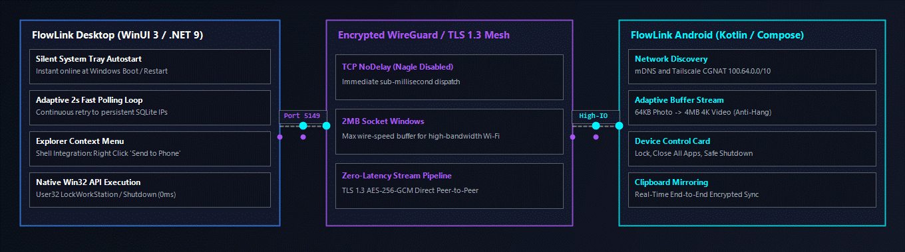

<div align="center">



# FlowLink Android

Fast and simple connection between your Android phone and Windows PC.

[](https://github.com/saferill/Flowlink-Desktop)
[](https://github.com/saferill/Flowlink-Android)
[](LICENSE)

<br/>

Send files quickly, share your clipboard automatically, and control your PC directly from your phone over local Wi-Fi or Tailscale.

</div>

---

## Screenshots

<div align="center">

| Home & Controls | Connected Devices | Settings |
| :---: | :---: | :---: |
|  |  |  |

### Windows Desktop Companion


</div>

---

## Download

To connect, install FlowLink on both your Android phone and your Windows PC.

| Platform | Download | Note |
| :--- | :--- | :--- |
| 📱 **Android** | [**Download APK (v1.0.0)**](https://github.com/saferill/Flowlink-Android/releases/latest) | Works on Android 8.0 and above |
| 💻 **Windows PC** | [**FlowLink Setup (.exe)**](https://github.com/saferill/Flowlink-Desktop/releases/latest) <br/> [**Portable (.zip)**](https://github.com/saferill/Flowlink-Desktop/releases/latest) | Windows 10 & 11 (WinUI 3) |

---

## What it does

- **File Sharing**: Send photos, videos, and large files directly to your PC without compressing them.
- **Clipboard Sync**: Copy text or links on your phone and immediately paste them on your computer.
- **Remote PC Actions**: Lock your screen, put your PC to sleep, or close apps straight from your phone.
- **Works with Tailscale**: Connect whether you are on the same Wi-Fi or away from home using Tailscale.
- **No Ads, No Trackers**: Free and open source software.

---

## How it works

<div align="center">
  
</div>

---

## Building from source

```bash
git clone https://github.com/saferill/Flowlink-Android.git
cd Flowlink-Android
./gradlew assembleRelease
```

---

## License

This project is licensed under the **[GNU General Public License v3.0 (GPL-3.0)](LICENSE)**.
Created by **[saferill](https://github.com/saferill)**.
