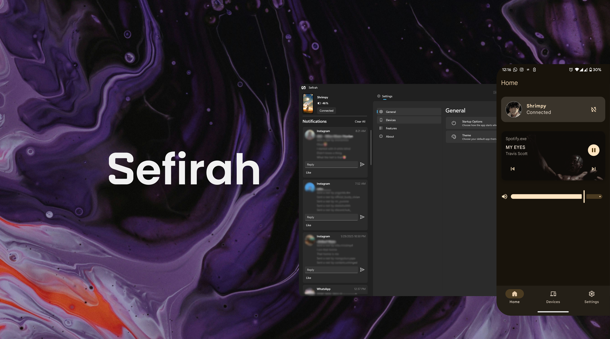
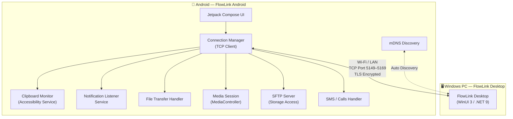
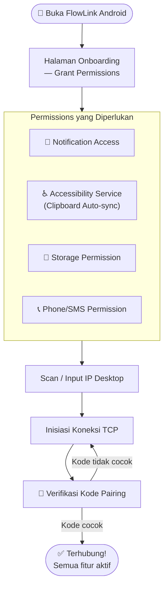
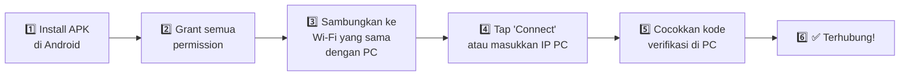
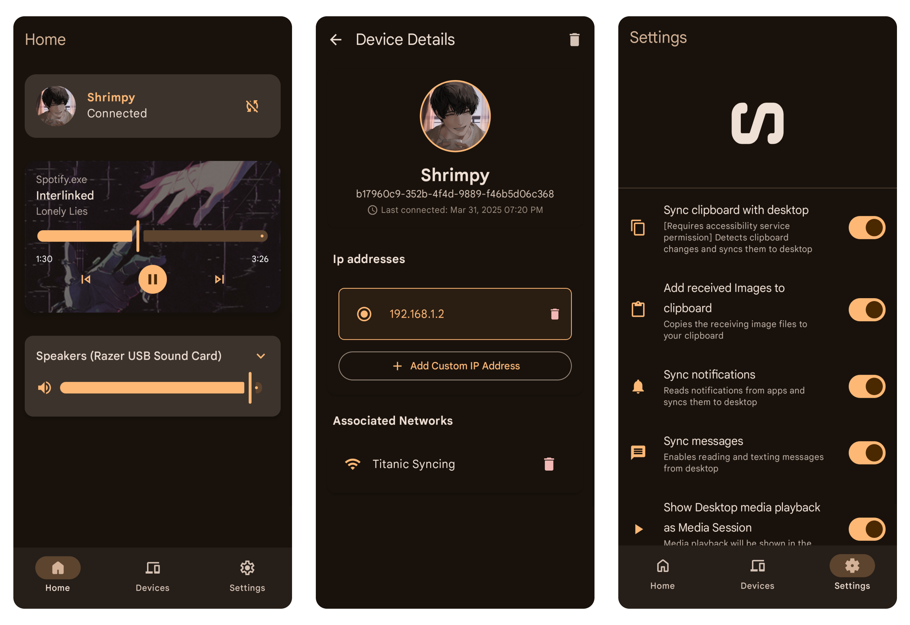

<p align="center">
  
</p>

<h1 align="center">FlowLink — Android</h1>

<p align="center">
  <em>Jembatan antara Android-mu dan Windows PC</em>
</p>

<p align="center">
  <a href="https://github.com/PLACEHOLDER/FlowLink"></a>
  <a href="https://discord.gg/MuvMqv4MES"></a>
  
  
</p>

---

## 🗺️ Arsitektur Sistem



---

## 🔄 Alur Permission & Koneksi



---

## ✨ Fitur

| Fitur | Deskripsi | Permission |
|-------|-----------|-----------|
| 📋 **Clipboard Sharing** | Sinkronisasi clipboard dua arah (teks & gambar) | Accessibility Service |
| 🔔 **Notification Mirror** | Kirim notifikasi Android ke Windows | Notification Listener |
| 📁 **File Sharing** | Kirim & terima file via share sheet atau drag-drop | Storage |
| 🗂️ **Storage Integration** | Expose storage Android ke Windows Explorer via SFTP | Storage (Android 11+) |
| 🎵 **Media Control** | Remote kontrol playback & volume dari PC | — |
| 📺 **Screen Mirroring** | Mirror layar Android ke PC via Scrcpy (USB/WiFi) | ADB |
| 💬 **SMS Texting** | Baca & balas SMS dari Windows | SMS + Contacts |
| 📞 **Call Management** | Terima & kelola panggilan masuk dari PC | Phone |

---

## 🏗️ Struktur Proyek

```
FlowLink Android/
├── app/                    # Entry point & DI setup
├── core/
│   ├── network/            # TCP Client, mDNS, TLS
│   ├── data/               # Repository & DataStore
│   └── common/             # Shared utilities
├── domain/                 # Use cases & interfaces
├── feature/
│   ├── connection/         # UI pairing & koneksi
│   ├── clipboard/          # Clipboard sync
│   ├── notifications/      # Notification listener
│   ├── filetransfer/       # File send/receive
│   └── media/              # Media session control
├── data/
│   ├── sftp/               # SFTP server (storage)
│   └── sms/                # SMS & Calls handler
└── build-logic/            # Gradle convention plugins
```

---

## 🚀 Instalasi

### Dari APK (Langsung)

Download **`FlowLink-Release.apk`** dari [Releases](https://github.com/PLACEHOLDER/FlowLink-Android/releases/latest), lalu:

```
⚠️ Catatan sideload:
Setelah install, buka App Info → "Allow restricted settings"
Ini diperlukan agar Notification & Accessibility permission bisa diaktifkan.
```

### Dari Store

[](https://play.google.com/store/apps/details?id=com.castle.FlowLink)
[](https://apt.izzysoft.de/fdroid/index/apk/com.castle.FlowLink)

---

## ⚡ Quick Start



---

## ⚙️ Build dari Source

```bash
# Clone repo
git clone https://github.com/PLACEHOLDER/FlowLink-Android.git

# Build debug APK
./gradlew assembleDebug

# Build release APK
./gradlew assembleRelease
```

**Persyaratan:** Android Studio · JDK 17+ · Android SDK 35+

---

## 🌍 Limitasi

### Notification Sync (Android 15+)
Notifikasi sensitif tidak bisa dibaca karena kebijakan Android. Fix via ADB:

```sh
adb shell appops set com.castle.FlowLink RECEIVE_SENSITIVE_NOTIFICATIONS allow
```

### Storage Integration
- Memerlukan **Android 11** atau lebih tinggi
- **⚠️ PERINGATAN:** Jangan arahkan remote storage ke folder yang sudah ada isinya — konten akan terhapus!

---

## 🤝 Kontribusi

Bug report & fitur request → buka issue di [repo Desktop](https://github.com/PLACEHOLDER/FlowLink/issues) kecuali masalah khusus Android.

Pull request sangat diterima!

- **Discord:** [discord.gg/MuvMqv4MES](https://discord.gg/MuvMqv4MES)

---

## 🙏 Terima Kasih

- **Clipboard via Accessibility:** [XClipper](https://github.com/KaustubhPatange/XClipper) oleh [@KaustubhPatange](https://github.com/KaustubhPatange)
- **SFTP Server:** [KDE Connect Android](https://github.com/KDE/kdeconnect-android)

---

<p align="center">
  
</p>
