<div align="center">


# ⚡ FlowLink Android

### *The Seamless, Privacy-Focused Bridge Between Android & Windows PC*

[](https://github.com/saferill/Flowlink-Desktop)
[](https://github.com/saferill/Flowlink-Android)
[](https://tailscale.com)
[](LICENSE)

<br/>

**FlowLink Android** connects your smartphone and Windows PC into a unified ecosystem. Enjoy **zero-latency real-time clipboard sync**, **encrypted peer-to-peer file transfers**, **remote PC power controls**, and **seamless Tailscale mesh discovery**.

</div>

---

## 📥 Download FlowLink (Both Devices Required)

> 💡 **Penting**: Untuk menghubungkan perangkat, pasang FlowLink di smartphone Android **DAN** di laptop/PC Windows kamu.

| Platform | Download Link | Deskripsi / Format |
| :--- | :--- | :--- |
| 📱 **Android** | [](https://apt.izzysoft.de/fdroid/index/apk/com.castle.FlowLink) <br><br> 📦 [**Download APK Langsung (v1.0.0)**](https://github.com/saferill/Flowlink-Android/releases/latest) | Pasang via F-Droid / IzzyOnDroid untuk update otomatis, atau unduh file APK resmi (Android 8.0+) |
| 💻 **Windows PC** | 📥 [**FlowLink Desktop Setup (.exe)**](https://github.com/saferill/Flowlink-Desktop/releases/latest) <br><br> 🗜️ [**FlowLink Desktop Portable (.zip)**](https://github.com/saferill/Flowlink-Desktop/releases/latest) | Installer resmi dengan shortcut Start Menu & Desktop, atau versi Portable tanpa instalasi |

---

## 🔗 Repositori Resmi
* 📱 **Android App Repo**: [saferill/Flowlink-Android](https://github.com/saferill/Flowlink-Android)
* 💻 **Windows Desktop Repo**: [saferill/Flowlink-Desktop](https://github.com/saferill/Flowlink-Desktop)

---

## 🌟 Architecture Overview

Open the interactive simulation in your browser:  
👉 **[`architecture.html`](./architecture.html)** *(Interactive motion flow, live packet simulator, and real-time signal waveforms)*

```mermaid
flowchart LR
    subgraph ANDROID["📱 FlowLink Android (Kotlin / Compose)"]
        direction TB
        A1["🚀 Network Discovery (mDNS & Tailscale CGNAT 100.64.0.0/10)"]
        A2["⚡ Adaptive Buffer Stream (64KB Photo ➔ 4MB 4K Video)"]
        A3["🔒 Device Control Card (Lock, Close All Apps, Shutdown)"]
        A4["📋 Clipboard & Notification Mirroring (E2EE)"]
    end

    subgraph MESH["🌐 Encrypted WireGuard / TLS 1.3 Mesh"]
        direction TB
        M1["TCP NoDelay (Nagle Disabled)"]
        M2["2MB Socket Windows"]
        M3["Zero-Latency Stream Pipeline"]
    end

    subgraph DESKTOP["💻 FlowLink Desktop (WinUI 3 / .NET 9)"]
        direction TB
        D1["🔄 Silent System Tray Autostart (Boot / Restart)"]
        D2["⏱️ Adaptive 3s Fast Polling Discovery Loop"]
        D3["🖱️ Explorer Context Menu ('Send to Phone')"]
        D4["⚡ Native Win32 API Execution (0ms Response)"]
    end

    ANDROID <===>|"Encrypted Sockets (Port 5149–5169)"| MESH
    MESH <===>|"High-Throughput IO"| DESKTOP
```



---

## 🚀 Fitur Unggulan

### 1. ⚡ Ultra Low-Latency Adaptive File Transfer
- **Micro-Burst Streaming (< 1 MB)**: Foto, dokumen kecil, dan catatan terkirim secara instan (**< 10–30 ms**).
- **High-Speed Large File Transfer (> 100 MB)**: Otomatis meningkatkan buffer ke **4 MB mega-chunks** dengan socket window 2 MB untuk memaksimalkan kecepatan transfer Wi-Fi lokal.

### 2. 📋 Real-Time Clipboard Synchronization
- Copy teks atau link di Android ➔ langsung bisa di-paste di Windows PC (dan sebaliknya).
- Proteksi loop cerdas (*smart hash debounce*) mencegah terjadinya perulangan pengiriman clipboard.

### 3. 🛡️ Privasi Aman & Tanpa Izin Berlebih
- Bebas dari izin overlay agresif ataupun akses pembacaan SMS sensitif, menjamin **100% aman untuk aplikasi perbankan (m-Banking)**.
- 100% Bebas Iklan (*No Ads*) dan Bebas Pelacak (*No Analytics / Tracking*).

### 4. 🌐 Tailscale Mesh Discovery
- Terhubung otomatis saat berada di satu jaringan Wi-Fi lokal, atau di mana pun di seluruh dunia menggunakan jaringan VPN Tailscale terenkripsi.

---

## 🛠️ Build dari Source Code

```bash
# Clone repository
git clone https://github.com/saferill/Flowlink-Android.git
cd Flowlink-Android

# Build Release APK
./gradlew assembleRelease
```

---

## 📜 Lisensi
Proyek ini dilisensikan di bawah lisensi **[GNU General Public License v3.0 (GPL-3.0)](LICENSE)**.
Dikembangkan dan dirawat secara aktif oleh **[saferill](https://github.com/saferill)**.
